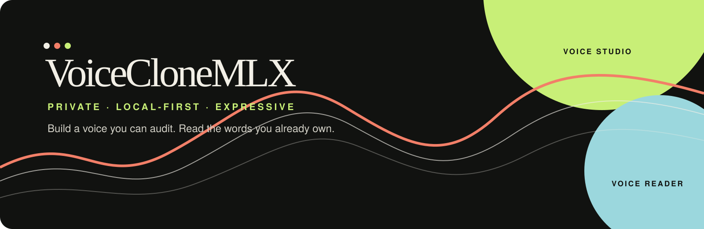

<h1 align="center">VoiceCloneMLX</h1>

<div align="center">



<br>

**A private, local-first voice laboratory for turning your own words into a reusable speaking voice.**

VoiceCloneMLX is a two-app macOS workspace: **Voice Studio** prepares a clean,
expressive voice dataset, and **Voice Reader** turns reviewed writing into
audio through a versioned voice-model bundle.

[Explore the project page](docs/index.html) · [Read the rendered procedure](docs/procedure.html) · [Open the six-file script](docs/six-block-script.html) · [Open the full script](docs/recording-script.html)

</div>

> [!IMPORTANT]
> **Honest status:** the application seams, manifests, safety gates, tests, and
> macOS launchers are in place. The real provider installation, trained-model
> conversion, and audible trained-model round trip still require a deliberate
> local verification. The current Reader composition root intentionally keeps a
> silent placeholder runtime disabled as a model, so silence is never presented
> as a cloned voice.

## At a glance

| | |
| --- | --- |
| **Platform** | Apple Silicon macOS · source-first `.app` launchers |
| **Privacy** | Local by default; no silent uploads or implicit model downloads |
| **Pipeline** | Record → transcribe → reject overlap → align → train → read |
| **Model handoff** | Immutable, checksummed voice bundles with explicit runtime IDs |
| **Project shape** | Two independently deletable apps with provider-neutral contracts |

<div align="center">

**[Quick start](#run-it-locally)** · **[How it works](#the-workflow)** · **[Safety](#safety-and-privacy-rules)** · **[Repository map](#repository-map)**

</div>

## What it is

VoiceCloneMLX is a personal, non-commercial tool for two connected jobs:

| Voice Studio | Voice Reader |
| --- | --- |
| Turn a prepared script or an all-day recording into reviewed, single-speaker training data. | Turn your `.txt`, `.docx`, text-based `.pdf`, or authorized website material into narrated audio. |
| Use local MLX Whisper resources to transcribe and time-align speech. | Load a selected, verified voice bundle independently of the training app. |
| Reject a whole clip when another voice overlaps you, rather than quietly keeping contaminated audio. | Generate resumable chunks, preserve provenance, and export WAV or MP3 audio. |
| Keep styles such as neutral, warm, energetic, serious, somber, questioning, emphasis, and dialogue attached to the data. | Choose among your own or other consented voice bundles when compatible runtimes exist. |

The durable asset is the dataset: lossless recordings, exact transcripts,
style labels, rejection evidence, checksums, and session provenance. Models can
change; a carefully curated corpus remains useful.

## What it is not

- It is not a hosted voice service.
- It does not silently upload private recordings, writing, or model weights.
- It does not call a reference-audio demo or a silent placeholder a trained
  personal model.
- It does not accept mixed-speaker clips for training. If another person talks
  over you at any point, the complete clip is rejected.
- It does not train a modern speech foundation model from random initialization.
  The intended path is fine-tuning a compatible pretrained model, with the
  exact model, revision, license, and runtime recorded in the bundle.

## The workflow

```text
your writing or conversation
            │
            ▼
      Voice Studio
  record → transcribe → reject overlap
       → align → review → dataset
            │
            ▼
    versioned voice bundle
            │
            ▼
      Voice Reader
  import text → review → synthesize
       → cache chunks → export audio
```

### 1. Prepare and record

Start with the [rendered 30-minute recording script](docs/recording-script.html)
or open its [Markdown source](data/scripts/voice_training_script_30_minutes.md).
It uses two short sessions, calibration passages, room tone, style markers,
and coverage for numbers, dates, dialogue, punctuation, technical language,
and difficult sounds. A curated script is better for the first model than
unstructured speech because every accepted clip has known text and deliberate
delivery metadata.

You can add all-day natural speech later. The free-speech pipeline transcribes
it with your local MLX Whisper installation and admits only segments that pass
speaker verification, overlap rejection, audio checks, and human review.

### 2. Build the dataset

The Studio pipeline preserves the master recording, extracts a local
transcription, finds style markers such as “This is the warm reading,” aligns
the known text, and emits sentence-level WAV clips with JSONL metadata. Every
row carries the text, style, timestamps, source session, and provenance needed
to audit or reproduce it.

### 3. Train or convert a model

The training boundary is provider-neutral. The current research points to an
MLX-compatible Qwen3-TTS path as the leading candidate, but the repository does
not claim that a real Qwen model has passed the final listen test yet. A future
provider task must:

1. run a tiny, bounded smoke test with the exact pinned revision;
2. train or fine-tune on an approved, split dataset;
3. evaluate held-out prompts against a zero-shot baseline;
4. preserve the source checkpoint and conversion provenance;
5. convert to a local runtime only after the source model passes; and
6. publish an immutable bundle with checksums and license metadata.

Remote GPU use is optional. Free notebook sessions are treated as resumable,
opportunistic workers; paid GPU use requires a hard cost cap, checkpoint plan,
automatic shutdown, and explicit approval.

### 4. Read with your voice

Voice Reader accepts owned or authorized `.txt`, `.docx`, text-based `.pdf`, and
website material. It keeps extraction separate from synthesis so the imported
text can be reviewed before any audio is generated. A verified model bundle is
selected explicitly; the Reader never guesses a compatible runtime.

<details>
<summary><strong>What the first successful session will look like</strong></summary>

1. Open **Voice Studio** and load the prepared script.
2. Record the two short pilot sessions with the same microphone position and
   room setup.
3. Let local transcription and overlap checks produce a review queue.
4. Keep only clean, owner-verified takes and inspect the generated manifest.
5. Run the bounded model smoke test before committing to a full training job.
6. Open **Voice Reader**, import a small text sample, select the verified bundle,
   and generate one WAV or MP3 file.

The last step is deliberately gated. Until a human has listened to real output,
the runtime remains unverified and the Reader must not imply that it is your
voice.

</details>

## Run it locally

The project is currently a source workspace with thin `.app` launchers. The
launchers point back to the repository's `src/` directory; they do not bundle a
Python interpreter, model weights, or a dependency environment.

### Requirements

- Apple Silicon macOS is the primary target.
- Python 3.10+ is recommended for the current source modules.
- Tkinter is needed for the desktop windows.
- Optional importers use `python-docx` for Word files and `pypdf` for text PDFs.
- MLX Whisper and a real TTS runtime are installed separately and remain
  opt-in. No model is downloaded implicitly.

### Launch from source

```bash
cd /Users/appleadmin/Apps/VoiceCloneMLX

PYTHONPATH=src python3 -m voiceclonemlx.studio_app
PYTHONPATH=src python3 -m voiceclonemlx.reader_app
```

### Build the two macOS app launchers

```bash
python3 scripts/build_apps.py
open "apps/Voice Studio.app"
open "apps/Voice Reader.app"
```

The build refuses to overwrite an existing bundle by default. Use
`--replace` only after checking the target is one of this project's own bundles
and keeping a rollback copy.

### Run the checks

```bash
PYTHONPATH=src python3 -m pytest -q
python3 /Users/appleadmin/.codex/skills/icm-check/scripts/icm_check.py .
git diff --check
```

The ICM check audits the workspace structure: each module has a defined job,
inputs, outputs, boundaries, and deletion-safe seams. It is not a substitute
for listening to generated speech.

Voice Reader accepts an output filename ending in `.wav` or `.mp3`. WAV is the
lossless runtime output. MP3 is encoded locally from that WAV using the first
available encoder in this order: LAME, ffmpeg, then macOS `afconvert`. No codec
is downloaded automatically.

<details>
<summary><strong>Command reference</strong></summary>

| Goal | Command |
| --- | --- |
| Launch Voice Studio | `PYTHONPATH=src python3 -m voiceclonemlx.studio_app` |
| Launch Voice Reader | `PYTHONPATH=src python3 -m voiceclonemlx.reader_app` |
| Build both launchers | `python3 scripts/build_apps.py` |
| Run the Reader tests | `PYTHONPATH=src python3 -m pytest -q tests/voice_reader/` |
| Run the full test suite | `PYTHONPATH=src python3 -m pytest -q` |
| Audit ICM structure | `python3 /Users/appleadmin/.codex/skills/icm-check/scripts/icm_check.py .` |

</details>

## Repository map

```text
src/voiceclonemlx/
├── recording/       capture and script storage
├── ingestion/       TXT, DOCX, PDF, and web extraction
├── alignment/       Whisper plans, markers, timestamps, overlap gates
├── dataset/         clip probes, rows, and split planning
├── training/        cost preflight, commands, evaluation, conversion
├── synthesis/       runtime adapters, readiness, and MLX bundle loading
├── studio_app/      Voice Studio composition and UI
├── reader_app/      Voice Reader composition and UI
└── shared/          versioned provider-neutral contracts

data/scripts/        teleprompters and script handoffs
docs/                procedures, architecture, research, and this page
scripts/             bounded packaging commands
tests/               focused contract and security tests
apps/                generated macOS .app launchers
```

## Safety and privacy rules

The repository treats a voice as sensitive personal data.

- Process locally by default. Do not upload private material without an explicit
  provider choice.
- Keep API, browser, GPU, and local-bus work one request at a time unless a
  measured, documented limit allows more.
- Cache and checkpoint external work; stop on rate limits, quota, auth, abuse,
  or repeated errors.
- Do not train on another person's voice without consent.
- Retain the original masters and rejection log; derived clips are not a
  replacement for the source recording.
- Require human listening before a runtime is marked verified.

See [OPERATIONS.md](OPERATIONS.md), [REPORTING.md](REPORTING.md), and the
[voice-model lifecycle contract](docs/architecture/voice-model-lifecycle.md)
for the full rules.

## Versioning

Software and voice bundles use separate Semantic Versioning histories.

- `PATCH` (`0.x.1`) fixes behavior without changing a public seam.
- `MINOR` (`0.1.x`) adds an optional, compatible capability.
- `MAJOR` (`1.0.0`) changes a required schema, runtime contract, artifact
  layout, or app boundary and requires a migration note.

Read [VERSIONING.md](VERSIONING.md) before changing a module. Never rewrite a
previous model bundle in place; publish a new immutable version.

## Contributing to this personal workspace

Keep changes small enough to delete independently. Start read-only, identify
the exact seam, write tests before implementation, and request an exact scoped
`APPROVED WRITE` before editing. Run the focused tests while developing, then
the full suite and ICM check at a substantial milestone. Never burst Git or
external services.

## License and voice rights

This repository is a personal, non-commercial utility. Code and model licenses
remain separate: record the exact license and revision for every base model,
checkpoint, dataset, and converter. Only use your own voice or a voice for
which you have explicit permission. This project is not legal advice.

## Further reading

- [Rendered real voice round-trip procedure](docs/procedure.html)
- [Markdown source for the procedure](docs/REAL_VOICE_ROUNDTRIP_PROCEDURE.md)
- [Voice model lifecycle](docs/architecture/voice-model-lifecycle.md)
- [TTS backend evaluation](docs/research/tts-backend-evaluation.md)
- [Personal TTS training research](docs/research/personal-tts-training.md)
- [MLX Whisper notes](data/scripts/MLX_WHISPER.md)
- [Project About description](docs/ABOUT.md)
- [VoiceCloneMLX package migration](docs/migrations/voiceclonemlx-package-rename.md)
